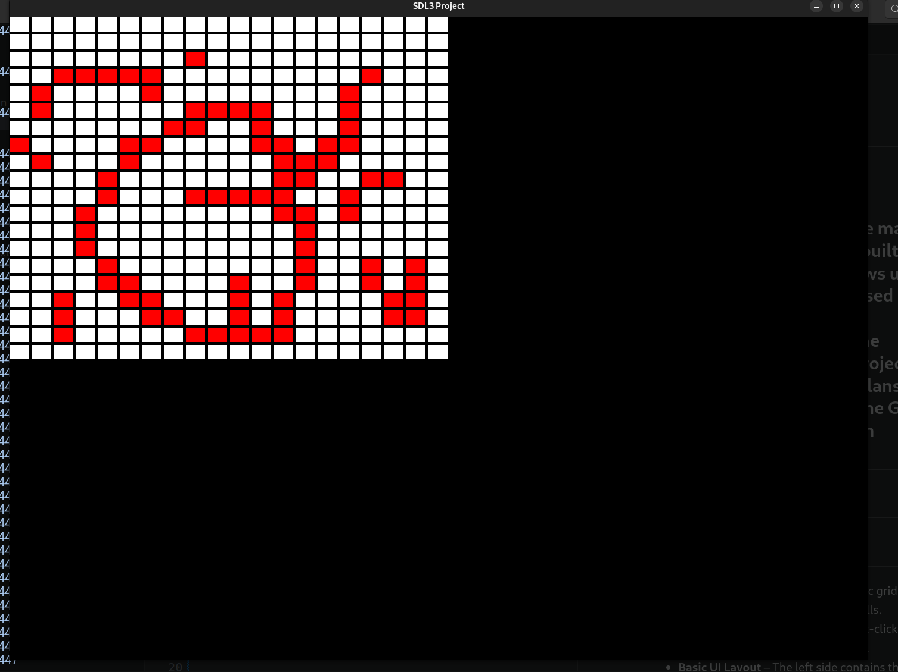

# Maze & Pathfinding Visualizer (SDL3)

## Overview
This project is an interactive **maze and pathfinding visualizer** built using **C++ and SDL3**. It allows users to create and edit a grid-based maze, apply pathfinding algorithms, and visualize the process in real-time. The project is still in development, with plans to expand features, improve the GUI, and allow custom algorithm integration.
---


---
## Current Features
- **Grid Rendering** – Displays a dynamic grid where users can interact with individual cells.  
- **Mouse Input for Editing Cells** – Left-click to mark cells, right-click to reset them.  
- **Basic UI Layout** – The left side contains the grid, while the right/bottom areas are reserved for UI elements (under development).  
- **SDL Event Handling** – Processes user input for interaction with the grid.  

---

## Planned Features
### 🔹 **Algorithm Selection UI**  
- Choose from various **maze generation** and **pathfinding algorithms**.  

### 🔹 **Maze Generation Algorithms**  
- Prim’s Algorithm  
- Recursive Backtracking  
- Kruskal’s Algorithm  
- Wilson’s Algorithm  

### 🔹 **Pathfinding Algorithms**  
- BFS (Breadth-First Search)  
- DFS (Depth-First Search)  
- Dijkstra’s Algorithm  
- A* Algorithm  
- Greedy Best-First Search  

### 🔹 **Additional Features**  
- **Real-Time Visualization** – Animates the algorithm’s progress with adjustable speed.  
- **Statistics Panel** – Displays metrics like **time taken, nodes explored, path length**, etc.  
- **Export Functionality** – Save the generated maze as **PNG/GIF**.  
- **Custom Algorithm Support** – Users can implement their own maze/pathfinding algorithms.  
- **Step-by-Step Execution Mode** – Allows users to manually step through the algorithm.  
- **Heatmap Visualization** – Colors cells based on exploration intensity.  
- **Theming & UI Improvements** – Improve the design with dark mode and customizable themes.  

---

## 🛠️ Build & Run

### **Requirements**
- **C++17** or newer  
- **CMake 3.10+**  
- **SDL3**  

### **Compilation Instructions**
```sh
mkdir build
cd build
cmake ..
make
./FOG  # Run the application
```

---
## **Contributing**
Contributions are welcome! If you’d like to add a new feature or improve existing code, feel free to submit a pull request or suggest ideas in the issues tab.
---
## License
This project is licensed under the **MIT License**. You are free to use, modify, and distribute it as long as you include the original license. See the `LICENSE` file for more details.
---